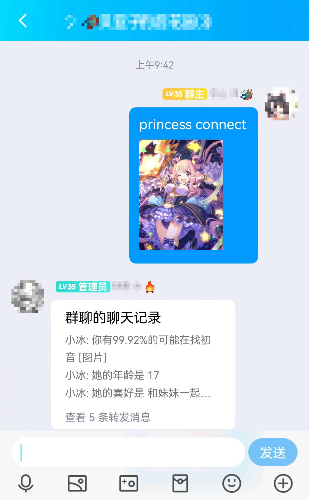
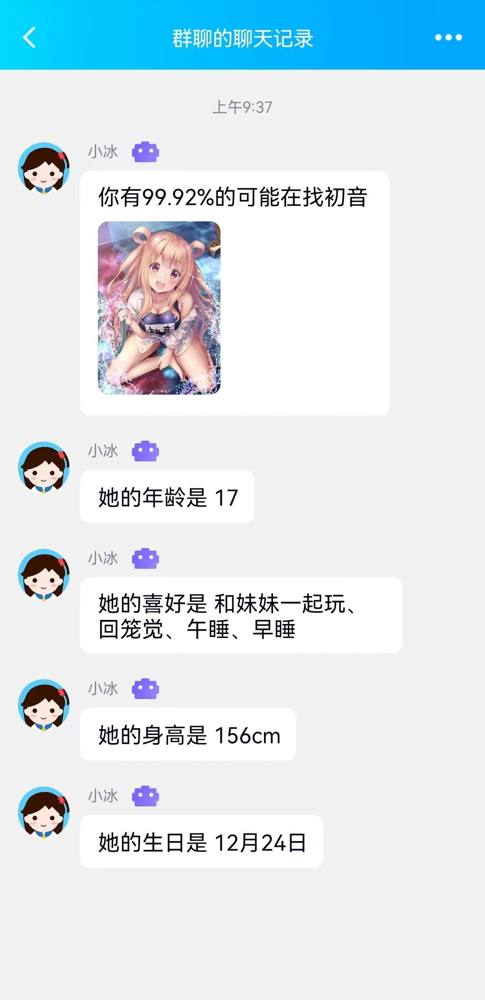
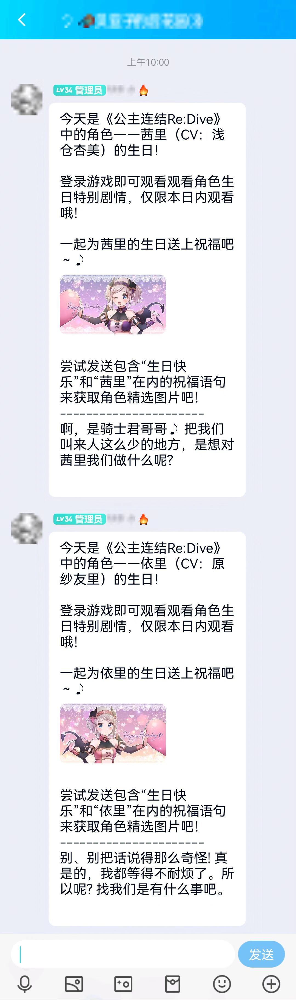
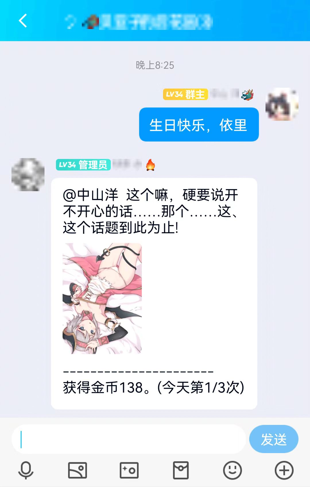

# pcr角色识别

## 本项目地址：

https://github.com/BeiYazi0/pcr_recognition

## 部署教程：

1.下载或git clone本插件：

在 HoshinoBot\hoshino\modules 目录下使用以下命令拉取本项目

git clone https://github.com/BeiYazi0/pcr_recognition

2.安装依赖:

pip install -r requirements.txt

3.下载模型

下载release中的pcr_recognition.h5，并放在models文件夹下。

4.启用：

在 HoshinoBot\hoshino\config\ **bot**.py 文件的 MODULES_ON 加入 'pcr_recognition'

然后重启 HoshinoBot

## 指令

【princess connect】 + 图片(@xx)

识别图片中的公主连结角色，以聊天记录形式返回判断结果(概率和角色精选图片)和该角色的四个描述。

【生日祝福】 

角色生日当天发送通知。收到包含“生日快乐”和角色名在内的祝福语，返回生日剧情语句和角色精选图片。前三次祝福随机获得100~200金币，金币与赛跑联动。

【动态推送】 推送公主连结ReDive的bilibili最新动态

## 测试效果
princess connect

生日祝福

## 备注

模型数据集总量为 4w 左右，包含 75 个角色（见duel_data.py），识别图像包含角色全身效果较好。

感觉比起模型本身，精选图片价值更高hhh。

等待更新中。。。
